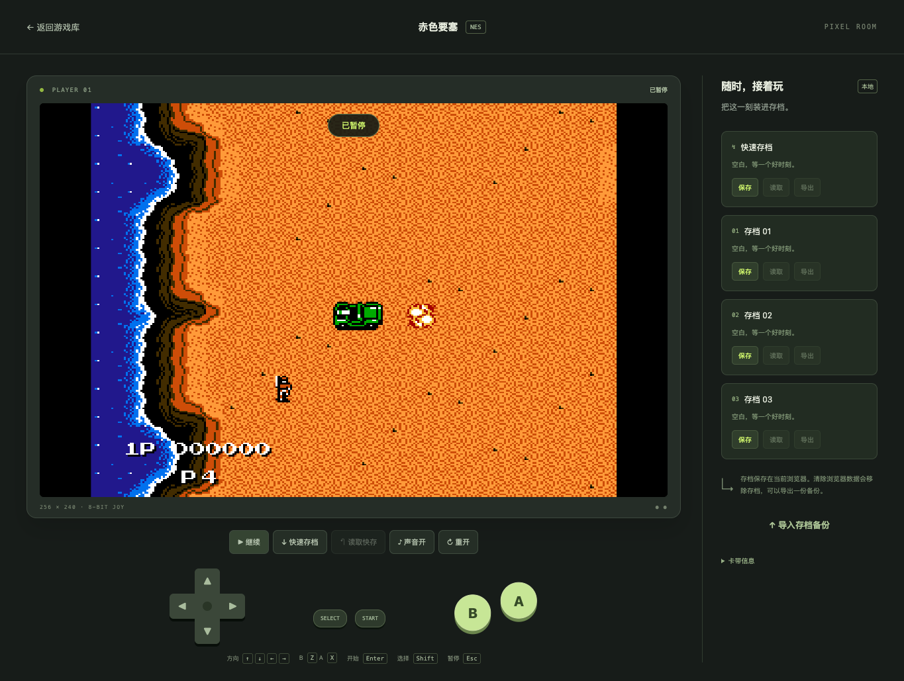

# 本地验收记录

日期：2026-09-15。范围为本地开发，测试数据来自用户指定的原始 ROM。

**本地版本已可运行。** Chrome 验证了实际游戏画面、操作、声音信号、保存恢复及文件边界；微信开发者工具已打开工程，并通过原生列表、详情进入 web-view 启动播放器。微信 iOS/Android 真机、正式域名与发布审核尚未验证。

## 环境与样本

| 项目 | 实际值 |
| --- | --- |
| 环境 | macOS，本地 127.0.0.1:5173 |
| Node / pnpm | 20.11.0 / 10.14.0 |
| 浏览器自动化 | 已安装 Google Chrome 152，Playwright 1.58.2，无头模式 |
| 微信开发者工具 | 2.02.2609022 Nightly，模拟器 iPhone 12/13 (Pro)，基础库 3.7.12 |
| 运行环境 | EmulatorJS 4.2.3 + FCEUmm，单线程 legacy 核心 |
| ROM | `/Users/zebo/Downloads/nes/赤色要塞.nes`，131,088 字节 |
| ROM SHA-256 | `98ed6d10391cccef249ce45cd935eb6263163f727fbf2fc11adb8116aa49f31d` |

使用原始文件运行，没有修复文件头、生成派生 ROM 或修改 Downloads 中的样本。包含 `DiskDude!` 的文件成功进入 Jackal 标题与实际关卡。无需因为朴素 Mapper 计算得到 66 而先修改文件。

## 自动检查

| 检查 | 结果与证据 |
| --- | --- |
| TypeScript 检查与构建 | H5 和小程序检查通过；Vite 构建通过 |
| 样本/格式单测 | 7/7 通过，含原始摘要、头格式、截断/超限、trainer、NES2、旧头、备份版本边界 |
| 运行时完整性 | 46 个锁定文件的长度与 SHA-256 通过校验 |
| 浏览器集成 | 4/4 通过；最后完整运行耗时约 49 秒 |
| 启动与独立下载 | 原 ROM 启动成功；运行中的资源请求均来自本机 |
| 声音与连续运行 | 30.2205 秒推进 1,813 帧，约 **59.99 FPS**；AudioContext=running，音频波形峰值约 0.491 |
| 操作 | 键盘 START、方向+A 组合；移动端同时触摸方向+A、取消触摸后按键全部释放 |
| 暂停 | 停止后帧计数不再推进；失焦自动暂停；暂停时旋转保留真实画面 |
| 即时存档 | 状态约 21.5 KiB；读取后重新序列化，完整字节摘要与保存值一致 |
| 存档持久化 | 手动槽、快存、页面重新进入后读取、清理 ROM 缓存后保留存档 |
| 备份 | JSON 导出及重新导入通过；错误运行版本备份被拒绝 |
| 缩略图 | 核心 PNG 内容含有效彩色像素，排除了“文件存在但整图黑色” |
| 异常 | 未登记 ID=404，旧摘要=409，写请求=405，直接读取 Downloads=403；ROM 校验失败与核心资源错误在页面提示 |
| 布局 | 1365×960、390×844、844×390；无横向溢出；截图已人工查看 |

连续运行的原始数据见 [测量 JSON](local-runtime-measurements.json)。音频波形检查证明存在有效输出，本轮未做扬声器主观音质评估；30 秒电脑测试也不替代手机 20 分钟稳定性测试。

## 微信开发者工具

通过界面导入项目，保留调试时已有 AppID 配置。原生列表成功读取同一本地 API，详情显示 ROM 摘要，web-view 完成核心与 ROM 加载，点击开始后进入运行状态。开发者工具未显示运行错误。

CLI 导入首次返回「服务端口关闭」，因此使用图形界面完成导入；没有为此修改安全端口设置。游客配置首次返回过系统错误，后续当前调试配置已可打开。账号能否用于正式产品仍需另行核实。

## 已修复的兼容性问题

1. EmulatorJS 的控制配置需要四个玩家对象，空对象会在初始化时报错。
2. 暂停时 `loadState` 只排队，必须等待核心执行并验证恢复结果。
3. 高级截图在 `retroarch + upscale=1` 下不返回；WebGL canvas 合成后读出的像素也可能是黑色。改为核心 PNG，并复用同一帧的截图。
4. 暂停旋转会让 canvas 缓冲区清空，改用暂停帧图片保持画面。
5. localhost 默认版本查询会访问外部 CDN，已将这条查询指向本地锁定文件。

## 截图

实际关卡：

其他视图：[游戏库](screenshots/library-desktop.png)、[存档画面](screenshots/player-desktop.png)、[竖屏](screenshots/player-mobile.png)、[横屏暂停](screenshots/player-landscape.png)。

后续待验：微信真机声音激活与后台恢复、实际触屏手感、长时间音画稳定性、存储回收、HTTPS 域名、账号/类目准入、服务端会话与云存档。当前结论为本地功能通过，不宣称微信正式交付或上线完成。
