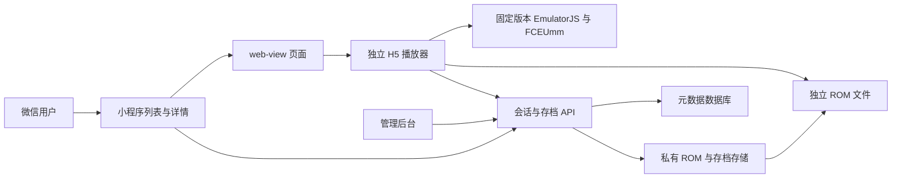

**微信 ROM 游戏播放器开发计划 v1.0（已确认；本地阶段已实施）**

规划日期：2026-09-15。用户已确认加载的是 ROM 游戏，并指定 [赤色要塞.nes](/Users/zebo/Downloads/nes/赤色要塞.nes) 作为测试样本。本文保留原规划基线。后续用户已确认开始开发并选择先做本地版本；原始 ROM 已运行，工程与本地验证详见 [本地验收记录](local-test-results.md)。原文件保持不变。

**产品目标是在微信小程序中选择、加载并游玩独立 ROM，平台统一提供操作界面和存档。** 规划以「原生小程序页面 + web-view + 独立 EmulatorJS 播放页面」作为优先验证路线。H5 是实际游戏运行层，也是早期兼容性验证载体；仅完成浏览器演示不算完成微信小程序交付。

| 决策状态 | 内容 |
| --- | --- |
| 已确认 | 游戏类型是 ROM；首个样本是指定路径的 NES 文件；已确认先完成本地开发 |
| 规划默认 | 首期只支持 NES/FC、单人；管理员导入 ROM，玩家从列表选择；玩家本地导入列入后续需求 |
| 技术候选 | EmulatorJS 4.2.3 + FCEUmm 核心，单线程；运行层使用独立 HTML 页面 |
| 待实测 | 样本在固定核心中的兼容性、微信真机的音频/触摸/存档/生命周期表现 |
| 微信接入前需提供 | AppID、主体类型、web-view 能力、可配置业务域名及游戏内容的准入信息 |
| 暂不采用 | Cocos 自研玩法方案；将原版 EmulatorJS 直接导入微信小游戏运行 |

**微信接入条件是早期决策关口。** 普通小程序 web-view 有主体和业务域名要求，承载 ROM 游戏还需核实实际服务类目、内容和审核要求。公开资料不能证明该产品形态可以直接上线。G1 关口未通过时，暂停依赖该路线的小程序正式化工作，保留已验证播放器，并提交原因与备选评估；不会把纯 H5 产品自动当作原需求已完成，也不会默认启动成本更高的原生模拟器移植。[微信 web-view](https://developers.weixin.qq.com/miniprogram/dev/component/web-view.html)、[微信运营规范](https://developers.weixin.qq.com/miniprogram/product/)。

用户使用流程规划为：打开小程序 → 查看游戏列表 → 打开详情 → 点击开始 → 加载播放器、核心和 ROM → 用户点击启动并激活声音 → 游玩 → 保存或返回。已有兼容存档时提供“继续游戏”和“重新开始”。加载失败时保留退出与重试操作。

| 首期功能 | 行为与边界 |
| --- | --- |
| 游戏列表与详情 | 展示名称、封面、简要说明、ROM 大小、最近游玩与可用状态；初期仅导入测试样本 |
| ROM 独立加载 | 游戏文件不写进页面 JS、不转为内嵌 Base64；按目录项获取匹配 ROM |
| 播放器 | 方向、A/B、Start/Select，暂停、重开、音量和退出；支持键盘调试与触屏多键 |
| 页面适配 | 横屏优先布局，同时提供可用的竖屏布局；不把强制旋转或浏览器全屏 API 作为必需条件 |
| 存档 | 一个快速存档槽与三个手动槽，本地保存优先；后续同一首期里程碑接入登录与云端备份 |
| 缓存 | 缓存程序、核心、ROM 和存档；可清理下载缓存，默认保留存档 |
| 基础管理 | 导入、检查、编辑游戏资料、测试、发布状态和下线；ROM 不按上传即公开处理 |
| 问题诊断 | 区分核心下载、ROM 下载、文件头兼容、初始化、音频与存档错误 |

首期不包含 GBA/PS1 等更多系统、联网对战、公共排行榜、广告与付费、公开第三方上传、作弊码和快进倒带。它们不会阻塞 NES 样本的首个可玩版本。

**推荐架构让小程序负责入口，H5 负责完整游戏过程。**

| 层 | 建议实现 |
| --- | --- |
| 小程序 | 微信原生 TypeScript、WXML、WXSS；列表、详情、播放器容器与设置页面 |
| H5 播放器 | TypeScript + Vite 多页面构建中的独立 `player.html`，控制 EmulatorJS 生命周期 |
| 模拟器 | EmulatorJS 4.2.3 为初始候选，明确选择 `fceumm`；下载与其兼容的核心产物并记录摘要 |
| 管理后台 | Vue 3 + TypeScript；与播放器使用独立入口，避免页面框架和模拟器争用 DOM |
| 后端 | Node.js + TypeScript + NestJS 单体服务；本地原型阶段可以先用固定目录与受控文件映射 |
| 数据 | PostgreSQL 保存用户、目录、版本与存档元数据；对象存储保存 ROM、封面和存档二进制 |
| 文件交付 | 本地受控 HTTP 服务用于电脑验证；微信真机使用配置正确的 HTTPS 地址；正式版可接对象存储/CDN |
| 部署 | 小程序代码、H5/模拟器程序、ROM 目录与二进制、API 分别版本化；前期不引入微服务或 Kubernetes |

本次查询的正式发布候选为 EmulatorJS 4.2.3；4.3.0-pre 的发布说明提示了核心不互换问题。具体核心构建 ID 和文件摘要必须在 P0 获取实际产物后锁定，不假定核心版本号与前端版本号相同。后续升级先走回归，正式页面不引用会随时间变化的 latest/stable URL。[发布版本](https://github.com/EmulatorJS/EmulatorJS/releases)。

EmulatorJS 官方对 SPA 嵌入建议使用独立 iframe。本计划让小程序 web-view 直接打开独立播放页，减少嵌套层级；若后续 H5 目录采用 SPA，才通过 iframe 或整页导航进入播放页，不直接把模拟器挂入 SPA 的受控 DOM。[嵌入说明](https://emulatorjs.org/docs/embed/)。

**首个技术关口围绕指定 ROM，而不是先开发完整后台。** 本地检查确认样本具有 NES 文件标识、128 KiB PRG 数据，体积与声明一致；文件头包含 `DiskDude!`。简单按标准头拼接会读出 Mapper 66，按 FCEUmm 的旧文件头处理逻辑可得到 Mapper 2 候选。核心当前源码存在兼容处理，但这不能证明尚未下载的 WebAssembly 产物已经能运行该文件。详见 [样本检查与测试计划](/Users/zebo/Documents/game-monitor/docs/rom-test-plan.md)。

P0 先用原始字节测试 FCEUmm。如果失败，记录核心版本、错误和画面，再比较同一发行系列的 Nestopia。不要仅依据文件名确定游戏版本、区域或 Mapper。确有必要处理文件头时，只生成独立派生测试副本并记录差异，保留原始样本和摘要；不把临时兼容处理掩盖成原文件通过。

**ROM 按内容标识管理，不以文件名作为唯一身份。** 游戏 ID 对应目录条目；ROM 全文件 SHA-256 对应精确字节版本；运行配置 ID 对应播放器版本、核心构建与重要核心设置。三者分别管理，避免换了核心或 ROM 后误读旧存档。

指定文件只作为本地测试输入。未来启动原型时，可以通过仅映射该文件的开发路由提供给播放器，禁止把整个 Downloads 目录设为静态目录。客户端使用 HTTP/HTTPS URL，手机无法直接访问 Mac 的绝对路径。正式内容走管理员导入及发布流程；测试文件不默认进入 Git、公开 CDN 或发布包。

**存档优先使用模拟器即时状态。** 样本头没有置位电池存档标记，不能依赖游戏内 SRAM 自动保存作为验收基础。用户点击“快速存档”时，捕获整个模拟状态，在本地写入成功后明确提示；联网且已登录时再上传云端。不能把“云端排队”显示成“云端已保存”。

保存和恢复通过 RuntimeAdapter 统一封装，业务接口见 [接口规范](/Users/zebo/Documents/game-monitor/docs/rom-package-and-api-spec.md)。P0 必须确认 4.2.3 实际可用的公开回调、数据格式和恢复方式。公开接口不能满足时，先使用模拟器原生保存入口完成验证，再记录所需的最小适配补丁；不散落使用内部方法。周期自动即时存档属于后续优化，不能将电池存档刷新事件误当成即时状态捕获。[EmulatorJS 配置与回调](https://emulatorjs.org/docs/options/)。

浏览器本地使用 IndexedDB 保存二进制状态和元数据，另有缓存目录用于可重新下载的资源；浏览器与微信 web-view 的存储隔离和清理行为需要实测，不能直接套用微信原生文件系统的 200MB 额度。首次无网未缓存时显示无法加载；已有缓存时尽力恢复，不承诺缓存永久有效。

**游戏运行不依赖 H5 与小程序实时通信。** H5 直接调用后端保存进度，返回小程序后重新拉取最新状态。小程序登录后由服务端签发短期、单次启动票据，H5 兑换限权会话；票据绑定用户、游戏、运行配置和过期时间，不能由客户端任意换游戏。默认 60 秒有效、一次兑换，具体字段见接口规范。AppSecret 仅在后端保存。[微信 web-view 消息机制](https://developers.weixin.qq.com/miniprogram/dev/component/web-view.html)。

程序、核心和 ROM 均采用不可变版本文件。发布新 ROM 时先完成校验和体验测试，再更新目录；保留旧存档所需的兼容运行配置。下线阻止新会话，旧会话按配置结束或提示退出；不能承诺撤销已下载到用户设备的字节。ROM 独立交付不等于游戏内容免于微信审核，公开发布前需落实对应权限和内容准入。

**开发按以下里程碑推进，原 Cocos 方案的估算不再适用。**

| 阶段 | 任务 | 交付证据 | 粗估投入 |
| --- | --- | --- | --- |
| P0 / G0 | 锁定候选运行产物，用指定原始 ROM 验证启动、操作、声音、即时存档；处理文件头兼容结论 | 电脑本地可玩原型、运行产物锁定表、ROM 测试记录 | 2–4 人日 |
| P1 / G1 | 建最小小程序 web-view 页面；验证 iOS/Android；核实账号、域名和产品准入条件 | 微信真机记录、运行环境矩阵、路线继续/调整结论 | 2–4 人日，外部等待另计 |
| P2 | 完善游戏目录、播放器 UI、加载失败恢复、本地存档和缓存 | 可以重复进入、退出、保存恢复的客户端 | 3–5 人日 |
| P3 | 实现管理员导入、目录 API、启动票据、用户云存档及发布记录 | 可管理的私有体验系统，第二个内容条目无需改播放器代码 | 4–7 人日 |
| P4 / G2 | 弱网、切后台、长时间运行、版本与存档回归；准备符合条件的体验/发布材料 | 验收记录、部署与回退说明、小程序体验版本 | 2–4 人日 |

完整首期粗估 13–24 人日，不包含资质/域名准备、微信审核等待、原生模拟器核心移植和公开内容库建设。原型表现可能改变估算；P0、P1 失败时先解决技术或准入阻碍，不继续机械消耗后续后台工期。

| 验收关口 | 必须满足 |
| --- | --- |
| G0：样本可运行 | 原始 ROM 的运行结果明确；可操作、有声音、即时存档恢复成功；如果仅派生副本通过需单独标明 |
| G1：微信路线成立 | 获得可用账号与域名条件，指定 iOS/Android 真机可运行，准入结论有明确依据；不能用浏览器结果代替 |
| G2：首期可交付 | 小程序内完整流程可用，弱网和异常可恢复，存档不串游戏，后台导入与下线可控，部署说明可复现 |

性能评估以模拟速度和声音连续性为主，不能把宿主页面 30 FPS 当作 60Hz 游戏可接受的半速运行。指定 ROM 在参考手机上连续 20 分钟无崩溃、无持续半速及音频断续；加载指标区分核心、ROM 和初始化。详细阈值、测量条件及失败处理见 [验收计划](/Users/zebo/Documents/game-monitor/docs/rom-test-plan.md)。

最终应交付小程序工程、独立 H5 播放器、运行产物锁定记录、基础后台/API、环境配置示例、ROM 检查与存档规范、测试记录及部署/回退文档。当前已完成本地播放器、原生小程序入口、本地 ROM 登记和测试；登录、云存档、后台发布及微信真机阶段继续按后续条件推进。
