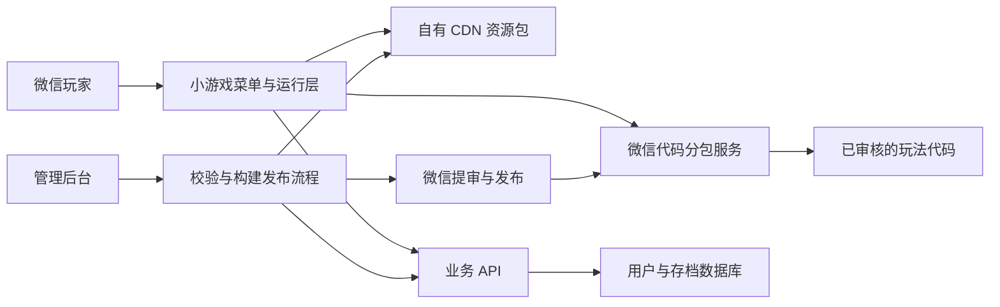

**微信游戏容器与独立游戏包技术方案（待确认）**

当前状态：此文为历史路线调研。用户已确认运行 ROM 游戏，当前开发规划以 [ROM 文档索引](/Users/zebo/Documents/game-monitor/docs/README.md) 为准；本页 Cocos 架构及工期不再作为实施基线。

调研日期：2026-09-15。当前工作区为空，本轮只整理方案，未创建应用、安装依赖或部署服务。已确认：目前没有现成游戏，需要先设计统一接入规范。尚未确认：游戏包由后台导入、开发团队接入，还是玩家从手机导入。

补充：用户提出评估 EmulatorJS，相关结论见 [EmulatorJS 可行性补充](/Users/zebo/Documents/game-monitor/docs/emulatorjs-feasibility.md)。下文 Cocos 建议面向自研游戏模块；若目标改为 FC/GBA 等 ROM，应按补充方案重新选择运行载体。两条路线均待确认。

**建议采用「微信小游戏 + 统一运行层 + 游戏代码分包 + CDN 资源包 + 管理后台」。** 用户在微信中进入产品、选择玩法、按需加载、游玩并保存进度。平台和游戏模块分别开发，但最终代码按微信发布机制统一构建、审核；图片、音频、关卡数据独立存放、下载和管理。

这项建议以首期开发自有轻量 2D 游戏为假设。如果必须使用普通小程序 AppID，或要求任意新游戏代码上传后立即运行，需重新选择路线。不能将下面的小游戏方案解释成普通小程序内的通用游戏文件执行器。

**最先需要接受的边界是：模块独立、按需下载和独立免发版上线，是三件不同的事。**

| 所需能力 | 推荐方案如何支持 |
| --- | --- |
| 游戏独立开发、独立交付 | 每个游戏一个受控模块，遵循相同引擎、SDK 和资源规范 |
| 用户点击后才加载游戏 | 游戏逻辑使用微信普通分包；资源按需从 CDN 下载 |
| 已有玩法的图片、音效、关卡数据更新 | 在现有代码支持、内容符合已审核范围的前提下独立发布资源版本 |
| 增加新玩法或修改游戏 JS/TS 逻辑 | 重新构建微信代码包，审核发布后运行 |
| 运营人员上传完整游戏包 | 可作为接入入口，但代码变更进入构建与审核流程，不能上传即绕过发版 |
| 玩家导入本地游戏文件 | 不纳入首期；将来可评估受控关卡/资源导入，不能等同于运行任意游戏程序 |

微信官方文档要求代码包文件修改后重新发布；Cocos 官方说明，微信小游戏不允许加载远程脚本，远程 Asset Bundle 的脚本会被移入随小游戏发布的代码目录。由此可知，远程资源包并不能提供任意新玩法代码热更新能力。[微信文件系统](https://developers.weixin.qq.com/minigame/dev/guide/base-ability/file-system.html)、[Cocos Asset Bundle](https://docs.cocos.com/creator/3.8/manual/zh/asset/bundle.html)。

**路线选择应同时看技术能力和微信准入要求。**

| 路线 | 游戏文件加载方式 | 适合的情况 | 本项目判断 |
| --- | --- | --- | --- |
| 普通小程序 + Canvas/WebGL | 随小程序发布代码，网络加载资源；引擎需要适配该环境 | 与主营功能相关的轻量交互，具体类目需核对 | 不作为以游戏为核心产品的默认路线 |
| 普通小程序 + web-view + H5 | 将 H5 包部署成 HTTPS 网站，再通过网页容器访问 | 已有 H5 内容，主体、域名、类目和内容得到允许 | 网页承载可行，但不能据此承诺游戏集合可以上线 |
| 微信小游戏 + 代码分包 + CDN | 微信下载已发布代码分包，自有 CDN 下载资源 | 自有轻量游戏、需要微信游戏能力和较稳定体验 | 首期推荐；多玩法产品形态仍需核实审核要求 |
| 普通小程序大厅 + 多个小游戏 AppID | 点击后打开另一个小游戏 | 经平台允许的业务跳转，各游戏分别发布 | 不是容器内运行；集中游戏推荐/跳转模式有明确限制 |
| 独立 H5 游戏平台 | 服务器部署各 H5 游戏，浏览器动态加载 | 新游戏需独立部署、不愿绑定微信代码发版 | 如果独立代码部署是硬要求，应优先评估；产品形态改变 |

微信的 web-view 是网页容器，需配置业务域名，个人类型小程序暂不支持。网页向小程序的 `postMessage` 在返回、组件销毁、分享等特定时机才交付，不能当作实时双向游戏通信通道；若选择此路线，实时存档和结算应由 H5 直接调用后端。它也不是直接打开手机 ZIP 包的通用接口。[web-view 官方文档](https://developers.weixin.qq.com/miniprogram/dev/component/web-view.html)。

微信运营规范要求游戏按游戏类目接入，并限制集中推荐、排行、跳转式的互推平台；跳转 API 文档也专门提示“小程序盒子”问题。因此不把“大厅跳往多个 AppID”当作默认可上线的备选。单个小游戏中包含多个自有玩法在工程上可以实现，但是否适合以一个产品申报，需要结合具体玩法、主体和审核反馈确认，不能由技术可行性推导审核结论。[微信运营规范](https://developers.weixin.qq.com/miniprogram/product/)、[跳转 API](https://developers.weixin.qq.com/miniprogram/dev/api/navigate/wx.navigateToMiniProgram.html)。

**建议先采用一个共享引擎的游戏运行层。** 菜单、加载界面、设置和游戏场景均在小游戏中实现；不依赖普通小程序的 WXML 页面嵌入游戏运行时。



图中的代码和资源使用不同发布渠道。后台不能向客户端下发任意脚本入口；客户端只加载当前微信版本中声明、登记的游戏模块。

| 模块 | 职责与建议技术 |
| --- | --- |
| 游戏客户端 | Cocos Creator 3.8 LTS 系列 + TypeScript，确认后锁定通过真机验证的精确版本 |
| 运行层 | 玩法选择、加载状态、场景切换、暂停恢复、统一错误页、资源管理 |
| 游戏 SDK | 提供存档、会话、音频设置、日志和退出等接口，游戏不直接操作平台账号凭据 |
| 内容与发布后台 | Vue 3 + TypeScript；管理游戏资料、包校验、资源版本、测试、发布记录与下线 |
| 业务服务 | Node.js + TypeScript + NestJS，首期采用单体服务，减少部署与排障成本 |
| 数据库 | PostgreSQL，存储用户、游戏、版本、会话、存档和操作记录 |
| 文件分发 | 对象存储 + CDN，例如腾讯云 COS；使用 HTTPS 与已配置的通信域名 |
| 构建环境 | 锁定 Cocos 编辑器、依赖和 SDK 的构建任务，生成微信产物与资源清单 |
| 监控 | 记录加载阶段耗时、失败原因、客户端错误、资源版本和服务端请求关联 ID |

Cocos 的资源组织和微信发布能力符合这个方向。若最终只有一两种极简单玩法，原生 Canvas + TypeScript 也可减少引擎开销，但动画、场景与资源管理需要更多自建工作。Unity/团结引擎留待确定重度 3D 需求后专项评估，首期不混合多个运行时。[Cocos 3.8 用户手册](https://docs.cocos.com/creator/3.8/manual/zh/index.html)。

**统一规范要覆盖开发输入、构建产物和运行时三个层面。** 不将任意 H5 ZIP、任意引擎导出目录或可执行文件视为通用游戏包。

开发输入建议采用一个工作区管理多个游戏模块。游戏可以分别维护和交付，但由统一工程构建，保留 Cocos `.meta` 文件，校验资源 UUID、脚本名称及依赖冲突。Cocos 官方对跨项目直接复用 Bundle 提示了版本和依赖兼容问题，因此首期不采用“多个完全独立工程随意导出，再由容器拼接”的流程。[Cocos Asset Bundle 的跨项目复用说明](https://docs.cocos.com/creator/3.8/manual/zh/asset/bundle.html)。

交付目录可约定为下列结构；这是待实施的规范示意，当前未创建这些应用目录。

```text
game-module/
  game.manifest.json       模块声明
  scripts/                 玩法代码，仅进入微信构建产物
  scenes/                  场景与预制体
  assets/                  图片、音频和其他素材
  levels/                  遵循固定结构的关卡数据
  meta/                    模块说明、授权信息与测试要求
```

构建后生成两类交付物：微信代码产物，以及可上传 CDN 的纯资源产物。Cocos 的“普通分包”和“远程 Bundle”有不同约束，不能简单把同一个 Bundle 同时设为两者。需在技术验证阶段确认代码具体落在主包还是分包、共享脚本如何归属，以及远程场景如何引用已经发布的组件。

| 清单字段 | 约定 |
| --- | --- |
| `schemaVersion` | 清单格式版本 |
| `gameId`、`displayName` | 稳定游戏标识与展示名称 |
| `sdkVersion`、`engineVersion` | SDK 兼容要求与锁定的精确引擎版本 |
| `codeRevision` | 玩法代码修订号；与微信构建内的模块登记表对应 |
| `subPackageName`、`entryScene` | 构建阶段确定的分包与入口场景；远程清单不能任意覆盖 |
| `resourceVersion`、`assetManifestHash` | 资源版本与资源清单摘要 |
| `compatibleCodeRevisions` | 明确列出兼容的代码修订号，不能只按“版本更大”猜测兼容性 |
| `files` | 文件相对路径、摘要、下载大小，以及需要时的解压后大小 |
| `saveSchemaVersion` | 存档结构版本与迁移要求 |
| `orientation`、`capabilities` | 方向、网络依赖和需要的 SDK 能力；首期统一竖屏 |

后台导入 ZIP 时仅作为交付格式使用，解压和校验放在服务端受控环境。客户端优先使用引擎支持的资源目录或小资源组按需加载，避免每次下载、解压整款游戏。文件路径必须限制在模块根目录内，校验真实类型、大小、压缩倍率与依赖，防止目录穿越和异常压缩包。检测到脚本或引擎代码变动时，必须转入代码发版流程。内容检查不只看扩展名，JSON 中也不承载可任意执行的新脚本。

| 游戏生命周期与 SDK 契约 | 预期行为 |
| --- | --- |
| `prepare(context)` | 校验依赖、获取资源和读取兼容存档，不启动游戏循环 |
| `start(options)` | 进入游戏，接收本次会话、关卡或随机种子 |
| `pause(reason)` / `resume()` | 处理切后台、设置和恢复，暂停计时与音频 |
| `serializeSave()` / `restoreSave(data)` | 导出、恢复带结构版本的存档 |
| `destroy()` | 释放节点、纹理引用、音频、事件和计时器，允许重复调用 |
| `context.storage` | 按用户和游戏隔离的存档读写 |
| `context.session` | 开始/结束会话、提交结果；服务端确定用户与可操作范围 |
| `context.assets` | 获取已授权且匹配版本的资源 |
| `context.settings` / `context.telemetry` | 统一设置和性能、错误上报 |
| `context.exit()` | 正常退出并回到菜单，完成清理 |

这些名称是拟定的业务接口，不是微信原生 API。首期只接入自有或经过代码审查的模块。模块共享 JS 运行环境，SDK 封装不能提供浏览器进程级的安全隔离；公开第三方游戏上传需要单独的信任与隔离设计。

**加载流程以当前客户端实际拥有的代码为准。**

1. 打开主包，显示菜单和加载反馈；取得当前客户端构建 ID、内置模块登记表与服务端目录。
2. 客户端与服务端共同确认某玩法已被当前版本包含、资源版本兼容且可用；新代码尚未安装时提示更新，不能尝试请求不存在的分包。
3. 玩家选择玩法后，调用微信分包加载能力加载对应代码，再获取匹配的资源清单。
4. 命中完整本地缓存则直接使用；缺失文件从 CDN 下载，展示进度、取消和重试。
5. 资源下载到暂存目录，核对大小和摘要，全部通过后切换本地有效版本指针。
6. 准备场景并恢复存档，然后开始游戏。后台异步预取后续关卡，但不阻塞首个可玩画面。
7. 游玩中在检查点保存进度；切后台立即暂停并尝试保存本地快照，网络恢复后同步。
8. 退出时保存、销毁场景和监听器，再按引用关系释放资源并回到菜单。

微信的 `wx.loadSubpackage` 会下载并执行代码；较新基础库提供只预下载、不执行代码的 `wx.preDownloadSubpackage`。预下载是可选优化，需要能力检测，不能作为启动的必备条件。[微信分包加载](https://developers.weixin.qq.com/minigame/dev/guide/base-ability/subPackage/useSubPackage.html)。

**包大小和缓存必须从第一版就纳入设计。** 以下平台数值来自本次读取的官方文档，实施时仍以实际 AppID、开发工具和最新文档复核。

| 项目 | 已核实的平台限制 | 建议的工程预算或处理 |
| --- | --- | --- |
| 微信小游戏代码包 | 主包不超过 4M；主包加分包不超过 30M | 主包目标不超过 3MB，为 SDK 与后续功能留余量 |
| 分包 | 普通单分包无单独大小上限，但受总包上限约束；独立分包不超过 4M | 首期使用普通分包，共享引擎和平台服务 |
| 持久文件存储 | 缓存文件与用户文件合计最多 200MB，满足条件可申请更高额度 | 暂按约 100MB 资源缓存软上限设计，为存档与更新峰值留空间 |
| 内存 | 磁盘资源大小不等于解码后内存或 GPU 占用 | 单次只运行一个玩法，限制纹理尺寸与音频常驻量，真机定预算 |

来源：[代码包](https://developers.weixin.qq.com/minigame/dev/guide/base-ability/code-package.html)、[分包加载](https://developers.weixin.qq.com/minigame/dev/guide/base-ability/subPackage/useSubPackage.html)、[文件系统](https://developers.weixin.qq.com/minigame/dev/guide/base-ability/file-system.html)。

资源缓存采用按游戏和版本组织的 LRU 清理，优先保留当前游戏，存档与资源缓存分开管理。下载前考虑“旧版本 + 新版本 + 临时文件/解压文件”的磁盘峰值；存储不足时先清理未使用版本，仍不足则给出可恢复错误。缓存可能被用户或系统清除，必须支持重新下载，不能承诺永久离线可用。

卸载场景不等于卸载整个代码模块。资源、对象和监听器可以释放，但已执行的 JS 分包不应假设能够完全卸载。同一会话内切换很多游戏仍可能累计代码和引擎缓存；需要通过切换测试控制规模。Cocos 的 `removeBundle` 也不自动释放已经加载的资源，应先按引用关系释放，避免共享素材被误删。[Cocos 资源释放说明](https://docs.cocos.com/creator/3.8/manual/zh/asset/bundle.html)。

**后台发布应明确区分资源发布与代码发布。**

资源发布顺序：导入 → 格式与依赖校验 → 对照代码修订号验证 → 内容检查和体验测试 → 上传不可变版本目录 → 检查 CDN 可访问性 → 更新兼容版本的资源指针。旧文件保留，不能直接覆盖同名文件或删除仍被旧客户端引用的版本。

代码发布顺序：导入受控模块 → 统一编译 → 包体与依赖检查 → 构建开发/体验版本 → 真机验证 → 微信提审 → 审核通过后发布 → 向实际具备该代码的客户端开放对应玩法。资源变更若实质上引入新玩法、改变服务类目或超出审核范围，也进入重新评估及必要的提审流程。

微信发布后，新旧客户端会并存，不能假设所有用户立刻运行最新版。运行层接入更新管理器，在合适的时机提示更新；服务端保留旧构建所需的目录、资源和接口兼容。后台可快速停用某玩法、回退到兼容的资源版本，但代码回退必须走微信支持的版本机制。[小游戏更新机制](https://developers.weixin.qq.com/minigame/dev/guide/runtime/update-mechanism.html)。

| 后台功能 | 首期内容 |
| --- | --- |
| 游戏资料 | 名称、封面、说明、方向、可见状态和接入信息 |
| 包管理 | 导入记录、类型识别、摘要、校验结果、代码/资源版本关联 |
| 体验与发布 | 体验版本记录、发布检查、审核状态、正式资源指针 |
| 故障处理 | 下线入口、兼容资源回退、失败版本追踪 |
| 审计与权限 | 管理员身份验证、角色控制、操作记录 |
| 运行数据 | 开始/退出次数、加载失败率、耗时分位数、版本分布 |

首期不把审核通过状态交给游戏包自报。后台需记录可核实的微信发布结果；是否自动对接微信发布 API，在确认账号能力后决定，最初可以保留人工完成微信提审的步骤。

**业务数据围绕用户、游戏与版本管理，先满足可靠存档。**

建议的数据实体为 `users`、`games`、`game_releases`、`client_builds`、`build_games`、`game_sessions`、`game_saves`、`audit_logs`。`build_games` 描述每个微信构建实际包含的模块代码，避免后台目录与客户端能力错配。

客户端通过微信登录凭证与后端建立自己的会话；AppSecret 仅保存在服务端。每次存档和结果提交都从服务端会话确定用户，不信任客户端传入的用户 ID。网络服务配置 HTTPS、下载域名和必要的 WSS 域名，按微信文档完成备案和域名设置；业务域名与普通 API 通信域名是两种配置。[微信网络文档](https://developers.weixin.qq.com/minigame/dev/guide/base-ability/network.html)。

存档键包含用户、游戏和存档槽，另存结构版本与修订号。采用本地检查点加云端备份，上传带预期修订号以发现冲突，重复请求通过幂等键处理。跨设备冲突需要显示两份进度供选择，不能静默覆盖。游戏版本变动提供存档迁移；回退前检查旧代码是否能够读取新存档。

首期以个人进度和个人最佳成绩为主。若加入公共排行榜或奖励，需要服务器校验关卡、时间、分数范围，并根据玩法采用可复核事件或服务端结算；HTTPS、签名或会话随机数不能单独证明客户端分数真实。联机对战、付费道具和广告奖励都应单独扩展服务端设计。

**对正式上线有实质影响的前置事项，应在大规模实现前核实。** 需要确认主体类型、游戏类目、实际玩法集合与申报名称、版权授权、账号所需资质，以及适用的隐私、未成年人保护与备案要求。由于目前没有 AppID 和具体游戏内容，无法从公开文档确认该项目的最终材料清单或审核结果；不把免费、不付费或仅加载资源视为免除准入要求的依据。[微信运营规范](https://developers.weixin.qq.com/miniprogram/product/)。

**建议首期用两款轻量样例验证接入规范。** 暂定拼图与记忆翻牌，统一竖屏、单人、无付费；它们只是用于验证模块化能力的候选玩法，最终按产品确认和准入结果调整。

1. **前置核实与技术验证，约 2–4 人日。** 确认小游戏路线和账号要求；验证一个主包、两个代码模块、远程资源加载、包体与场景释放；核对 Cocos 构建后脚本的实际位置。
2. **运行层与 SDK，约 4–6 人日。** 完成生命周期、加载与错误恢复、版本匹配、本地缓存与存档规范。
3. **两个样例模块，约 4–7 人日。** 让两种玩法都通过相同 SDK 接入，验证切换和资源替换，不为第二款游戏修改容器核心逻辑。
4. **后台与后端，约 5–8 人日。** 完成登录、目录、云存档、包校验、资源发布、记录与下线。
5. **真机验证与上线准备，约 3–5 人日。** 覆盖低端设备、弱网、旧版本兼容、回退及体验版发布材料。

粗估总量为 18–30 人日，属于工程规划估算，不是交付承诺。按单人连续投入约 4–6 周；不包含平台审核等待、主体材料办理、正式商业游戏制作或大量美术工作。若只验证“两个游戏分别加载并切换”，可先做约 3–5 人日的技术原型，再依据测量结果确定完整排期。

首期范围建议包括菜单、两个样例、统一 SDK、代码分包、远程资源、缓存、存档、基础管理后台与错误监控。公开第三方上传、任意本地游戏导入、实时对战、虚拟支付、广告变现和多引擎混跑，待需求明确后分别估算。

| 验收项目 | 需要看到的证据 |
| --- | --- |
| 独立接入 | 第二款游戏使用同一规范接入，不修改容器核心；没有重复引擎和共享依赖冲突 |
| 按需加载 | 抓取真实加载记录，确认未选择游戏时未下载其非必要资源，代码落点符合设计 |
| 版本兼容 | 旧客户端收到新目录仍能运行兼容内容，不会调用不存在的分包或脚本 |
| 资源更新 | 修改受控图片或关卡数据后可发布并回退，过程不混用不同版本文件 |
| 中断恢复 | 断网、下载取消、文件损坏与存储不足时，可重试或退出，旧有效版本不被破坏 |
| 生命周期 | 连续切换至少 20 次后，监听器与计时器不累积、音频不串场、内存无持续失控增长 |
| 存档可靠性 | 切后台、异常退出、重复提交与跨设备冲突不会静默丢失已保存进度 |
| 平台真实性 | iOS 与 Android 真机通过，关闭“忽略域名和证书校验”后仍可正常使用 |
| 包体 | 使用正式构建统计主包和总包大小，满足微信限制并留有迭代空间 |

性能目标应在指定设备、网络和样例资源大小后测量。初步可将中端手机稳定 60 FPS、低端手机可玩 30 FPS、缓存命中后的进场 P95 不超过 1.5 秒作为优化目标，不能在没有真机数据前当作已实现指标。首次加载分别统计代码下载、资源下载、解析和首个可交互画面，避免只记录总耗时。[微信运行环境说明](https://developers.weixin.qq.com/minigame/dev/guide/runtime/env.html)。

成本由游戏开发工作、API 与数据库、对象存储和 CDN 流量组成。粗算月资源下行量可用「DAU × 日均资源下载次数 × 每次实际下载 MB × 30 ÷ 1024」得到 GB，再按选定云产品当期价格计费；不把 CDN 边缘缓存命中当作玩家不产生下行流量。比如假设 1,000 DAU、每日一次、每次实际下载 5MB，约为 146GB/月，这只是容量示例，尚未核价。当前缺少用户量和资源体积，不给出虚假的固定月费。

**建议本轮确认的内容是：采用微信小游戏载体，首期统一 Cocos + TypeScript；允许游戏代码随微信版本审核发布，资源独立更新；先接入自有轻量 2D 模块，并用两个样例验证规范。** 游戏交付入口可选开发团队导入或后台上传受控包，两者都遵守相同构建与发布边界。

如果“上传任意新玩法代码后立刻可玩、不经过微信发版”是必需条件，应先改为评估独立 H5 平台，而不是继续按本方案实现小游戏。当前方案待确认，尚未开始应用开发。
